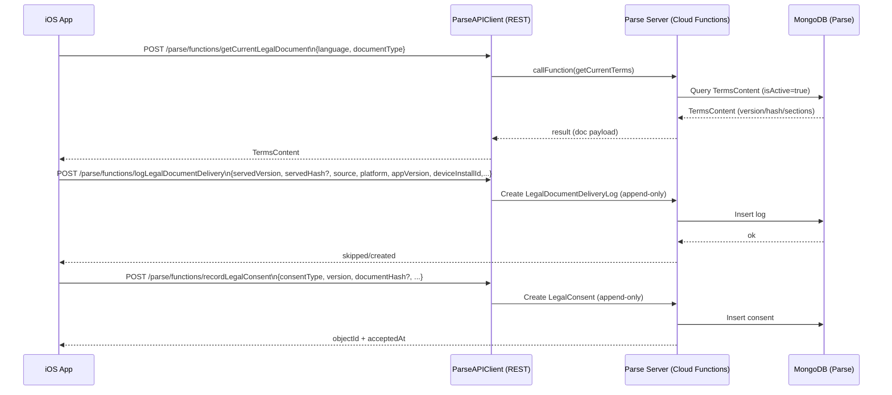
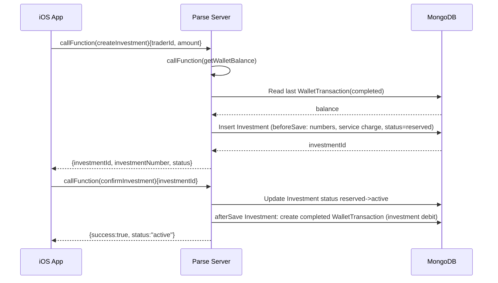
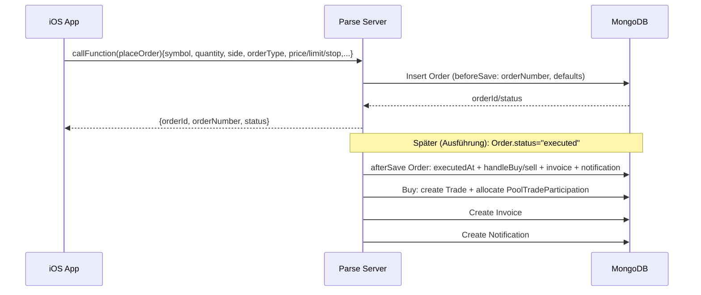

## Zweck

Diese Spezifikation beschreibt die **Detail-Architektur**, **APIs**, **Datenmodell-Grundlagen** und das **Security-Konzept** von FIN1 – abgeleitet aus Code/Config (siehe `00_INDEX.md`).

## 1) Detail-Architektur (Module/Schichten/Abhängigkeiten)

### iOS App (SwiftUI)

**Schichten/Prinzipien**

- **Views** binden nur an ViewModels, keine Businesslogik in Views.
- **ViewModels** orchestrieren, delegieren Businesslogik an Services.
- **Services** implementieren Protokolle und werden über `AppServices` injiziert.
- **Composition Root**: `FIN1/FIN1App.swift` (setzt `Environment(\.appServices)`).

**Feature-Module (aus `FIN1/Features/`)**

- `Authentication`: Login/Signup/Onboarding, RiskClass/Experience Calculation, Token Storage (Keychain/Memory), Terms Step.
- `Dashboard`: Role-based Einstieg, KPIs.
- `Investor`: Discovery/Portfolio/Watchlist, Investor Cash Balance.
- `Trader`: Depot/Holdings, Orders/Trades, Live Query Subscriptions, Statistics.
- `CustomerSupport`: Tickets, SLA, Surveys, Audit Logging, 4-Augen Queue, Knowledge Base/FAQ.
- `Admin`: Reporting, Rounding Differences, Configuration.

**Zentrale Services (Auszug aus `AppServices`)**

- Parse: `ParseAPIClient` (REST), `ParseLiveQueryClient` (WebSocket).
- Compliance: `AuditLoggingService`, `TransactionLimitService` (iOS-seitig), `BuyOrderValidator`-Pattern (Regelwerk).
- Legal: `TermsContentService`, `TermsAcceptanceService`.
- Trading: Order/Trade Lifecycle, Invoice/Transaction IDs, CashBalance Services.

### Backend (Docker / Parse Server)

**Parse Server**

- Express App mountet:
  - `/parse` (REST API + Cloud Functions)
  - `/dashboard` (Parse Dashboard)
  - `/health` + `/api-docs`
- Live Query läuft über WebSocket am selben Port (Server-seitig via `ParseServer.createLiveQueryServer`).

**Cloud Code Layout**

- Entry: `backend/parse-server/cloud/main.js`
- Cloud Functions: `backend/parse-server/cloud/functions/*.js`
- Triggers: `backend/parse-server/cloud/triggers/*.js`
- Utils: `backend/parse-server/cloud/utils/helpers.js`

## 2) Sequenzdiagramme (kritische Flows)

### (A) Legal Document (Fetch → Delivery Log → Consent)

### (B) Investment: create → confirm → wallet movement

### (C) Trading: placeOrder → Trigger erstellt Trade/Invoice/Notifications

## 3) API-Definitionen

### 3.1 Basiskonzept (Parse REST + Cloud Functions)

- **Base URL** (Produktion über Nginx): `http://<HOST>/parse`
  (iOS Default: `http://192.168.178.24/parse`, Dev-Simulator: `http://localhost:1338/parse` via SSH Tunnel)
- **Cloud Functions**: `POST /parse/functions/<name>`
- **REST Klassen**: `GET/POST/PUT/DELETE /parse/classes/<ClassName>`
- **Headers**
  - `X-Parse-Application-Id`: `fin1-app-id` (aus `.xcconfig`/Info.plist)
  - `X-Parse-Session-Token`: erforderlich für user-auth Functions (Login required)

### 3.2 Cloud Functions (aktuell implementiert)

> Rückgaben sind direkt aus `backend/parse-server/cloud/functions/*.js` übernommen.

#### Health/Config

- **`health`** (Cloud): returns `{status,timestamp,version,cloudCode}`
- **`getConfig`**: params `{environment?}` → liefert Config aus Parse-Klasse `Config` oder Defaults (inkl. `financial`, `features`, `limits`)

#### User/FAQ

- **`getUserProfile`**: auth required → `{ user, profile, address, riskAssessment }`
- **`updateProfile`**: auth required, params `{firstName?, lastName?, salutation?, dateOfBirth?, phoneNumber?}` → `{success:true}`
- **`completeOnboardingStep`**: auth required, params `{step, data?}` → `{success, nextStep?, onboardingCompleted}`
- **`getFAQCategories`**: params `{location?}` → `{categories:[...]}`
- **`getFAQs`**: params `{categorySlug?, isPublic?}` → `{faqs:[...]}`

#### Investment

- **`getInvestorPortfolio`**: auth required → `{investments:[...], summary:{...}}`
- **`createInvestment`**: auth required, params `{traderId, amount}` → `{investmentId, investmentNumber, status}`
- **`confirmInvestment`**: auth required, params `{investmentId}` → `{success:true, status:"active"}`
- **`discoverTraders`**: params `{minRiskClass?, maxRiskClass?, limit?, skip?}` → `{traders:[...], total}`

#### Trading

- **`getOpenTrades`**: auth required → `{trades:[...]}`
- **`getTradeHistory`**: auth required, params `{limit?, skip?, status?}` → `{trades:[...], total, hasMore}`
- **`calculateOrderPreview`**: params `{symbol, quantity, price, side, orderType}` → `{grossAmount, fees, netAmount, ...}`
- **`placeOrder`**: auth required, params `{symbol, quantity, price?, side, orderType, limitPrice?, stopPrice?, tradeId?}` → `{orderId, orderNumber, status}`
- **`getHoldings`**: auth required → `{holdings:[...]}`

#### Wallet

- **`getWalletBalance`**: auth required → `{balance, lastTransactionAt}`
- **`getTransactionHistory`**: auth required, params `{limit?, skip?, type?}` → `{transactions:[...], total, hasMore}`
- **`requestDeposit`**: auth required, params `{amount}` → `{transactionId, transactionNumber, status:"pending"}`
- **`requestWithdrawal`**: auth required, params `{amount, iban?}` → `{transactionId, transactionNumber, status:"pending"}`

#### Notifications

- **`markNotificationRead`**: auth required, params `{notificationId}` → `{success:true}`
- **`getUnreadNotificationCount`**: auth required → `{total, byCategory:{...}}`

#### Admin/Compliance

- **`getAdminDashboard`**: auth required, role in {admin, customer_service, compliance}
- **`searchUsers`**: auth required, params `{query?, role?, status?, limit?, skip?}` → `{users:[...], total}`
- **`updateUserStatus`**: auth required, params `{userId, status, reason?}` → `{success:true}` (+ schreibt `AuditLog`)
- **`getPendingApprovals`**: auth required → `{requests:[...]}`
- **`approveRequest`**: auth required, params `{requestId, notes?}` → `{success:true}`

#### Reports

- **`getDocuments`**: auth required, params `{type?, limit?, skip?}` → `{documents:[...], total, hasMore}`
- **`getInvoices`**: auth required, params `{type?, limit?, skip?}` → `{invoices:[...], total, hasMore}`
- **`getAccountStatements`**: auth required, params `{year?}` → `{statements:[...]}`
- **`getTraderPerformance`**: auth required, trader-only, params `{period?}` → `{trades:{...}, profit:{...}}`
- **`getInvestorPerformance`**: auth required, params `{period?}` → `{investments:{...}, financials:{...}}`

#### Legal

- **`getCurrentLegalDocument`**: params `{language:"de|en", documentType:"terms|privacy|imprint"}` → doc payload (siehe Code-Kommentar)
- **`logLegalDocumentDelivery`**: params `{documentType, language, servedVersion, servedHash?, source, platform, appVersion, buildNumber, deviceInstallId,...}` → `{skipped, objectId, createdAt?}`
- **`recordLegalConsent`**: params `{consentType, version, documentHash?, documentUrl?, platform, appVersion, buildNumber, deviceInstallId, acceptedAt?}` → `{objectId, acceptedAt}`

### 3.3 Fehlercodes / Fehlerverhalten (Backend)

- Parse nutzt `Parse.Error.*` (z.B. `INVALID_SESSION_TOKEN`, `INVALID_VALUE`, `OPERATION_FORBIDDEN`, `OBJECT_NOT_FOUND`).
- HTTP: typischerweise 4xx bei Validation/Auth, 5xx bei Serverfehlern.

## 4) Datenmodell (Kurzüberblick)

> Vollständigkeit/Details hängen von Schema im Parse Dashboard ab. Unten sind die Klassen, die im Cloud Code aktiv verwendet werden.

### Zentrale Parse Klassen

- **Identity/Profil**: `Parse.User`, `UserProfile`, `UserAddress`, `UserRiskAssessment`, `NotificationPreference`
- **Investments**: `Investment`, `PoolTradeParticipation`, `Commission`
- **Trading**: `Order`, `Trade`, `Holding`
- **Wallet**: `WalletTransaction`
- **Dokumente**: `Document`, `Invoice`, `AccountStatement`
- **Support**: `SupportTicket`, `TicketSLATracking`, `SatisfactionSurvey`
- **Admin/Compliance**: `ComplianceEvent`, `AuditLog`, `FourEyesRequest`, `FourEyesAudit`
- **Legal**: `TermsContent`, `LegalDocumentDeliveryLog`, `LegalConsent`
- **Push**: `PushToken`
- **Konfiguration**: `Config`

### Serverseitige Unveränderlichkeit (Audit)

- `TermsContent` ist **append-only** (historische Inhalte dürfen nicht geändert/gelöscht werden).
- `LegalDocumentDeliveryLog`, `LegalConsent`, `ComplianceEvent` dürfen **nicht gelöscht** werden (Trigger `beforeDelete`).

## 5) Security-Konzept (Kurzfassung)

### iOS

- **Token Storage**: `KeychainTokenStorage` (Produktiv), `InMemoryTokenStorage` (DEBUG).
- **Netzwerk**: Parse REST + LiveQuery WS; Dev erlaubt HTTP für lokale IPs (ATS Exceptions in `Info.plist`).

### Backend

- **Secrets**: `.env` außerhalb Repo; `env.production.example` ist Template (keine echten Keys).
- **Master Key Hardening**: `masterKeyIps` restriktiv, Dashboard idealerweise nur über SSH Tunnel.
- **CORS**: `ALLOWED_ORIGINS` (Comma-separated).
- **HTTP Security**: Helmet (CSP für Dashboard deaktiviert; Produktion ggf. härten).

