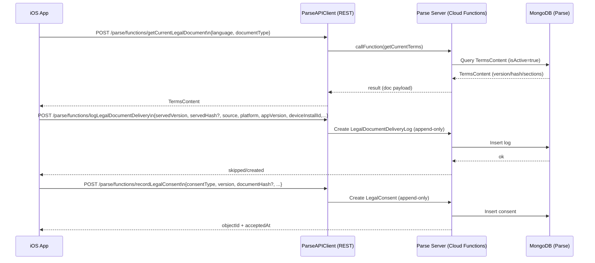
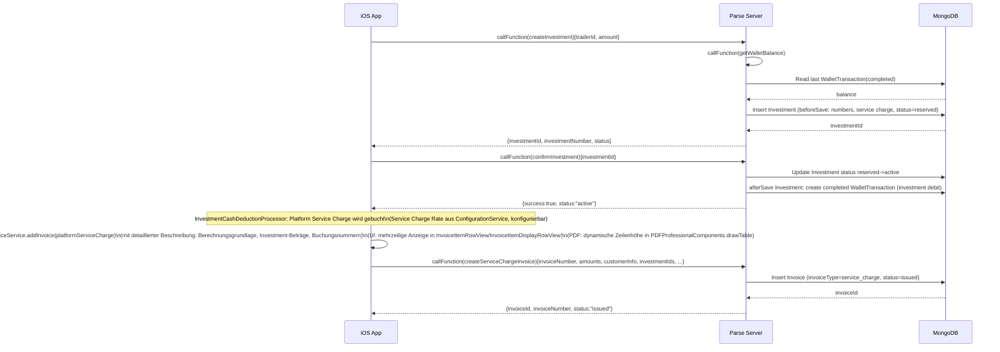
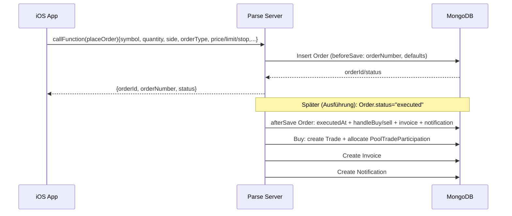

## Konfigurierbare Finanzparameter

**WICHTIG**: Die folgenden Parameter sind über das **Web-Admin-Portal** konfigurierbar (empfohlen) oder über die Swift-App (legacy):

### Kritische Parameter (4-Augen-Prinzip)

Diese Parameter erfordern eine Genehmigung durch einen zweiten Administrator:

| Parameter | Standard | Cloud Function | Beschreibung |
|-----------|----------|----------------|--------------|
| `traderCommissionRate` | 5% (0.05) | `requestConfigurationChange` | Trader-Provision |
| `initialAccountBalance` | €50.000 | `requestConfigurationChange` | Startguthaben |
| `platformServiceChargeRate` | 1.5% (0.015) | `requestConfigurationChange` | Plattformgebühr |

**Workflow:**
1. Admin A beantragt Änderung → `FourEyesRequest` wird erstellt
2. Admin B genehmigt/lehnt ab via Admin-Portal (`/approvals`)
3. Bei Genehmigung: Backend wendet Änderung an + Audit-Log

**Backend-Dateien:**
- `backend/parse-server/cloud/functions/configuration.js` - 4-Augen Cloud Functions
- `backend/parse-server/cloud/utils/configHelper.js` - Zentralisierte Config-Logik

### Nicht-kritische Parameter

Diese können direkt geändert werden:

- **Minimum Cash Reserve**: Standard €12.00, konfigurierbar über `ConfigurationService.updateMinimumCashReserve()`
- **Pool Balance Distribution Threshold**: Schwellenwert für Pool-Verteilung

Alle Rates verwenden `effective*` Properties mit Fallback auf `CalculationConstants` Defaults, falls nicht konfiguriert.

### Admin-Zugriff

| Methode | URL | Empfohlen für |
|---------|-----|---------------|
| **Web-Admin-Portal** | `https://192.168.178.24/admin/configuration` | Alle Config-Änderungen |
| Swift Admin-UI | In-App → Configuration | Read-Only / Legacy |

### Trader-Dokumente (Rechnung, Sammelabrechnung)

- **Emittent (Issuer)** = Wertpapieremittent; es gibt eine Emittentenliste. Anzeige über WKN-Mapping: Single Source `String.emittentName(forWKN:)` in `FIN1/Shared/Extensions/String+Emittent.swift`. Rechnung und Wertpapierzeile der Sammelabrechnung zeigen den echten Emittenten (nicht Platzhalter "Issuer").
- **Handelsplatz (Trading Venue)** = Wo gehandelt wird; **nicht** mit Emittent verwechseln. Handelsplätze sind **nicht festgelegt** und werden **erst in Live-Produktion** belegt. Bis dahin: Platzhalter `TradeStatementPlaceholders.tradingVenue` in `TradeStatementDisplayData.swift` (z. B. "—"). Kein fester Börsenname (z. B. "Vontobel") als Handelsplatz verwenden.
- Details und Belegnummern: siehe **Abschnitt 6** in diesem Dokument; Cursor Rule: `.cursor/rules/trader-documents.md`.

## Zweck

Diese Spezifikation beschreibt die **Detail-Architektur**, **APIs**, **Datenmodell-Grundlagen** und das **Security-Konzept** von FIN1 – abgeleitet aus Code/Config (siehe `00_INDEX.md`).

## 1) Detail-Architektur (Module/Schichten/Abhängigkeiten)

### iOS App (SwiftUI)

**Schichten/Prinzipien**

- **Views** binden nur an ViewModels, keine Businesslogik in Views.
- **ViewModels** orchestrieren, delegieren Businesslogik an Services.
- **Services** implementieren Protokolle und werden über `AppServices` injiziert.
- **Composition Root**: `FIN1/FIN1App.swift` (setzt `Environment(\.appServices)`).

**Feature-Module (aus `FIN1/Features/`)**

- `Authentication`: Login/Signup/Onboarding, RiskClass/Experience Calculation, Token Storage (Keychain/Memory), Terms Step.
- `Dashboard`: Role-based Einstieg, KPIs.
- `Investor`: Discovery/Portfolio/Watchlist, Investor Cash Balance.
- `Trader`: Depot/Holdings, Orders/Trades, Live Query Subscriptions, Statistics.
- `CustomerSupport`: Tickets, SLA, Surveys, Audit Logging, 4-Augen Queue, Knowledge Base/FAQ.
- `Admin`: Reporting, Rounding Differences, Configuration.

**Zentrale Services (Auszug aus `AppServices`)**

- Parse: `ParseAPIClient` (REST), `ParseLiveQueryClient` (WebSocket).
- Compliance: `AuditLoggingService`, `TransactionLimitService` (iOS-seitig), `BuyOrderValidator`-Pattern (Regelwerk).
- Legal: `TermsContentService`, `TermsAcceptanceService`.
- Trading: Order/Trade Lifecycle, Invoice/Transaction IDs, CashBalance Services.
- Backend Sync: `TradeAPIService`, `InvestmentAPIService`, `OrderAPIService` für iOS → Backend Synchronisation.

**Swift 6 Concurrency & Thread Safety**

- **@MainActor**: Alle ViewModels (59/60) sind mit `@MainActor` markiert für Compiler-enforced Thread-Safety. Ausnahme: `SellOrderViewModel` (LimitOrderMonitor Protocol Constraints).
- **Sendable**: Alle Kern-Models (Investment, Trade, Order, User, Transaction, etc.) konform zu `Sendable` für sicheren Datenaustausch zwischen Actor-Grenzen.
- **App-Lifecycle Hooks**: `FIN1App.swift` nutzt `scenePhase` für automatische Backend-Synchronisation bei App-Background (Investments + Orders parallel).

**Architektur-Patterns**

- **MVVM**: Views → ViewModels → Services (Protocol-basiert)
- **Dependency Injection**: Über `AppServices` und `Environment(\.appServices)`
- **Repository Pattern**: Datenzugriff abstrahiert (z.B. `InvestmentRepository`)
- **Service Lifecycle**: `ServiceLifecycle` Protocol für start/stop/reset

### Backend (Docker / Parse Server)

**Parse Server**

- Express App mountet:
  - `/parse` (REST API + Cloud Functions)
  - `/dashboard` (Parse Dashboard)
  - `/health` + `/api-docs`
- Live Query läuft über WebSocket am selben Port (Server-seitig via `ParseServer.createLiveQueryServer`).

**Cloud Code Layout**

- Entry: `backend/parse-server/cloud/main.js`
- Cloud Functions: `backend/parse-server/cloud/functions/*.js`
- Triggers: `backend/parse-server/cloud/triggers/*.js`
- Utils: `backend/parse-server/cloud/utils/helpers.js`

## 2) Sequenzdiagramme (kritische Flows)

### (A) Legal Document (Fetch → Delivery Log → Consent)

### (B) Investment: create → confirm → wallet movement → service charge invoice

### (C) Trading: placeOrder → Trigger erstellt Trade/Invoice/Notifications

## 3) API-Definitionen

### 3.1 Basiskonzept (Parse REST + Cloud Functions)

- **Base URL** (Produktion über Nginx): `http://<HOST>/parse`
  (iOS Default: `http://192.168.178.24/parse`, Dev-Simulator: `http://localhost:1338/parse` via SSH Tunnel)
- **Cloud Functions**: `POST /parse/functions/<name>`
- **REST Klassen**: `GET/POST/PUT/DELETE /parse/classes/<ClassName>`
- **Headers**
  - `X-Parse-Application-Id`: `fin1-app-id` (aus `.xcconfig`/Info.plist)
  - `X-Parse-Session-Token`: erforderlich für user-auth Functions (Login required)

### 3.2 Cloud Functions (aktuell implementiert)

> Rückgaben sind direkt aus `backend/parse-server/cloud/functions/*.js` übernommen.

#### Health/Config

- **`health`** (Cloud): returns `{status,timestamp,version,cloudCode}`
- **`getConfig`**: params `{environment?}` → liefert Config aus Parse-Klasse `Config` oder Defaults (inkl. `financial`, `features`, `limits`)

#### User/FAQ

- **`getUserProfile`**: auth required → `{ user, profile, address, riskAssessment }`
- **`updateProfile`**: auth required, params `{firstName?, lastName?, salutation?, dateOfBirth?, phoneNumber?}` → `{success:true}`
- **`completeOnboardingStep`**: auth required, params `{step, data?}` → `{success, nextStep?, onboardingCompleted}`
- **`getFAQCategories`**: params `{location?}` → `{categories:[...]}`
- **`getFAQs`**: params `{categorySlug?, isPublic?}` → `{faqs:[...]}`

#### Investment

- **`getInvestorPortfolio`**: auth required → `{investments:[...], summary:{...}}`
- **`createInvestment`**: auth required, params `{traderId, amount}` → `{investmentId, investmentNumber, status}`
- **`confirmInvestment`**: auth required, params `{investmentId}` → `{success:true, status:"active"}`
- **`discoverTraders`**: params `{minRiskClass?, maxRiskClass?, limit?, skip?}` → `{traders:[...], total}`

#### Trading

- **`getOpenTrades`**: auth required → `{trades:[...]}`
- **`getTradeHistory`**: auth required, params `{limit?, skip?, status?}` → `{trades:[...], total, hasMore}`
- **`calculateOrderPreview`**: params `{symbol, quantity, price, side, orderType}` → `{grossAmount, fees, netAmount, ...}`
- **`placeOrder`**: auth required, params `{symbol, quantity, price?, side, orderType, limitPrice?, stopPrice?, tradeId?}` → `{orderId, orderNumber, status}`
- **`getHoldings`**: auth required → `{holdings:[...]}`

#### Wallet

- **`getWalletBalance`**: auth required → `{balance, lastTransactionAt}`
- **`getTransactionHistory`**: auth required, params `{limit?, skip?, type?}` → `{transactions:[...], total, hasMore}`
- **`requestDeposit`**: auth required, params `{amount}` → `{transactionId, transactionNumber, status:"pending"}`
- **`requestWithdrawal`**: auth required, params `{amount, iban?}` → `{transactionId, transactionNumber, status:"pending"}`

#### Notifications

- **`markNotificationRead`**: auth required, params `{notificationId}` → `{success:true}`
- **`getUnreadNotificationCount`**: auth required → `{total, byCategory:{...}}`

#### Admin/Compliance

- **`getAdminDashboard`**: auth required, role in {admin, customer_service, compliance}
- **`searchUsers`**: auth required, params `{query?, role?, status?, limit?, skip?}` → `{users:[...], total}`
- **`updateUserStatus`**: auth required, params `{userId, status, reason?}` → `{success:true}` (+ schreibt `AuditLog`)
- **`getPendingApprovals`**: auth required → `{requests:[...]}`
- **`approveRequest`**: auth required, params `{requestId, notes?}` → `{success:true}`

**Hinweis**: Finanzielle Konfiguration (z.B. `traderCommissionRate`, `platformServiceChargeRate`) erfolgt über `ConfigurationService` im iOS-Code (admin-only). Backend-Config (`getConfig`) liefert Default-Werte, aber die tatsächliche Konfiguration wird clientseitig verwaltet.

#### Reports

- **`getDocuments`**: auth required, params `{type?, limit?, skip?}` → `{documents:[...], total, hasMore}`
- **`getInvoices`**: auth required, params `{type?, limit?, skip?}` → `{invoices:[...], total, hasMore}`
- **`getAccountStatements`**: auth required, params `{year?}` → `{statements:[...]}`
- **`getTraderPerformance`**: auth required, trader-only, params `{period?}` → `{trades:{...}, profit:{...}}`
- **`getInvestorPerformance`**: auth required, params `{period?}` → `{investments:{...}, financials:{...}}`
- **`createServiceChargeInvoice`**: auth required, params `{invoiceNumber, grossServiceChargeAmount, netServiceChargeAmount, vatAmount, vatRate, batchId?, investmentIds?, customerInfo}` → `{invoiceId, invoiceNumber, status:"issued"}` (persistiert Platform Service Charge Invoice im Backend mit detaillierter Beschreibung: Berechnungsgrundlage, Investment-Beträge, Buchungsnummern, Split-Informationen). Die Beschreibung wird in der UI mehrzeilig angezeigt und im PDF mit dynamischer Zeilenhöhe gerendert.

#### Legal

- **`getCurrentLegalDocument`**: params `{language:"de|en", documentType:"terms|privacy|imprint"}` → doc payload (siehe Code-Kommentar)
- **`logLegalDocumentDelivery`**: params `{documentType, language, servedVersion, servedHash?, source, platform, appVersion, buildNumber, deviceInstallId,...}` → `{skipped, objectId, createdAt?}`
- **`recordLegalConsent`**: params `{consentType, version, documentHash?, documentUrl?, platform, appVersion, buildNumber, deviceInstallId, acceptedAt?}` → `{objectId, acceptedAt}`

### 3.3 Fehlercodes / Fehlerverhalten (Backend)

- Parse nutzt `Parse.Error.*` (z.B. `INVALID_SESSION_TOKEN`, `INVALID_VALUE`, `OPERATION_FORBIDDEN`, `OBJECT_NOT_FOUND`).
- HTTP: typischerweise 4xx bei Validation/Auth, 5xx bei Serverfehlern.

## 4) Datenmodell (Kurzüberblick)

> Vollständigkeit/Details hängen von Schema im Parse Dashboard ab. Unten sind die Klassen, die im Cloud Code aktiv verwendet werden.

### Zentrale Parse Klassen

- **Identity/Profil**: `Parse.User`, `UserProfile`, `UserAddress`, `UserRiskAssessment`, `NotificationPreference`
- **Investments**: `Investment`, `PoolTradeParticipation`, `Commission`
- **Trading**: `Order`, `Trade`, `Holding`
- **Wallet**: `WalletTransaction`
- **Dokumente**: `Document`, `Invoice`, `AccountStatement`
- **Support**: `SupportTicket`, `TicketSLATracking`, `SatisfactionSurvey`
- **Admin/Compliance**: `ComplianceEvent`, `AuditLog`, `FourEyesRequest`, `FourEyesAudit`
- **Legal**: `TermsContent`, `LegalDocumentDeliveryLog`, `LegalConsent`
- **Push**: `PushToken`
- **Konfiguration**: `Config`

### iOS → Backend Synchronisation

**Implementierte Services mit Backend-Sync:**

| Service | Sync-Typ | Beschreibung |
|---------|----------|--------------|
| `TradeAPIService` | Write-through | Trades werden bei Erstellung sofort zum Server gesendet |
| `InvestmentAPIService` | Write-through + Background | Investments werden bei Erstellung gesendet, Batch-Sync bei App-Background |
| `OrderAPIService` | Write-through + Background | Buy/Sell Orders werden bei Platzierung sofort synchronisiert; pending Orders werden bei App-Background nachgezogen |
| `PoolTradeParticipationService` | Write-through | Partizipationen werden bei Trade-Erstellung sofort synchronisiert |
| `DocumentAPIService` | Write-through + Background | Dokumente werden bei Upload sofort synchronisiert; pending Uploads werden bei App-Background nachgezogen |
| `MockPaymentService` | Write-through + Background | Wallet-Transactions werden bei Erstellung sofort synchronisiert; recent Transactions werden bei App-Background nachgezogen |
| `UserService` | Write-through + Background | User-Profile-Updates werden bei Änderung sofort synchronisiert; Profile wird bei App-Background nachgezogen |
| `WatchlistAPIService` | Write-through + Background | Watchlist-Items werden bei Hinzufügen/Entfernen sofort synchronisiert; alle Watchlist-Items werden bei App-Background nachgezogen |
| `FilterAPIService` | Write-through + Background | Filter werden bei Speicherung/Update/Löschung sofort synchronisiert; alle Filter werden bei App-Background nachgezogen |
| `PushTokenAPIService` | Write-through + Background | Push-Token werden bei Registrierung/Update sofort synchronisiert; aktuelle Token werden bei App-Background nachgezogen |
| `PriceAlertService` | Write-through + Background | Price Alerts werden bei Erstellung/Update/Löschung sofort synchronisiert; alle Alerts werden bei App-Background nachgezogen |
| `InvestorWatchlistAPIService` | Write-through + Background | Investor Watchlist-Items werden bei Hinzufügen/Entfernen sofort synchronisiert; alle Watchlist-Items werden bei App-Background nachgezogen |
| `AuditLoggingService` | Write-through | Compliance-Events werden sofort geloggt |

**Architektur (effizient, ressourcenschonend):**

1. **Write-through**: Lokal speichern + async zum Backend senden (fire-and-forget)
2. **Lazy Batch-Sync**: Pending-Änderungen werden bei App-Background gebündelt synchronisiert (Investments + Orders + Transactions + Documents + User Profile + Watchlist + Filters + Push Tokens + Price Alerts + Investor Watchlist parallel)
3. **Merge-Strategie**: Backend-Daten werden mit lokalen Daten gemergt (keine Überschreibung)

**App-Lifecycle Hook Implementierung:**

- **Hook**: `FIN1App.swift` → `handleAppEnteredBackground()` wird bei `scenePhase == .background` aufgerufen
- **Sync-Methode**: `syncPendingDataToBackend()` führt parallele Synchronisation aus:
  - `investmentService.syncToBackend()` - Sync pending Investments
  - `orderManagementService.syncToBackend()` - Sync pending Orders (nicht completed/cancelled)
  - `paymentService.syncToBackend()` - Sync recent Transactions (letzte 24h)
  - `documentService.syncToBackend()` - Sync recent Documents (letzte 24h)
  - `userService.syncToBackend()` - Sync User Profile Updates
  - `securitiesWatchlistService.syncToBackend()` - Sync Watchlist Items
  - `filterSyncService.syncToBackend()` - Sync Saved Filters (Securities + Trader Discovery)
  - `notificationService.syncPushTokensToBackend()` - Sync Push Notification Tokens
  - `priceAlertService.syncToBackend()` - Sync Price Alerts
  - `watchlistService.syncToBackend()` - Sync Investor Watchlist (Trader Watchlist)
- **Ressourcenschonend**: Nur bei App-Background, nicht bei jedem Speichern
- **Fehlerbehandlung**: Fehler werden geloggt, blockieren aber nicht den App-Lifecycle
- **Parallelisierung**: Alle Syncs laufen parallel für maximale Effizienz

### Serverseitige Unveränderlichkeit (Audit)

- `TermsContent` ist **append-only** (historische Inhalte dürfen nicht geändert/gelöscht werden).
- `LegalDocumentDeliveryLog`, `LegalConsent`, `ComplianceEvent` dürfen **nicht gelöscht** werden (Trigger `beforeDelete`).

## 5) Security-Konzept (Kurzfassung)

### iOS

- **Token Storage**: `KeychainTokenStorage` (Produktiv), `InMemoryTokenStorage` (DEBUG).
- **Netzwerk**: Parse REST + LiveQuery WS; Dev erlaubt HTTP für lokale IPs (ATS Exceptions in `Info.plist`).

### Backend

- **Secrets**: `.env` außerhalb Repo; `env.production.example` ist Template (keine echten Keys).
- **Master Key Hardening**: `masterKeyIps` restriktiv, Dashboard idealerweise nur über SSH Tunnel.
- **CORS**: `ALLOWED_ORIGINS` (Comma-separated).
- **HTTP Security**: Helmet (CSP für Dashboard deaktiviert; Produktion ggf. härten).

## 6) Belege und Rechnungen (GoB, Nummern, Emittent/Handelsplatz)

**Unveränderliche Grundsätze (GoB):**

- **Eindeutige Belegnummern für alle Belege**: Jeder Beleg (Rechnung, Verrechnung/Collection Bill, Gutschrift) erhält eine eindeutige Belegnummer (über `TransactionIdService`); keine Duplikate, fortlaufend nachvollziehbar.
- **Jeder buchungstechnisch wirksame Vorgang hat einen Beleg**: Jeder Vorgang, der buchungsrelevant ist (z. B. Kauf/Verkauf Rechnung, Investor Collection Bill, Service-Charge-Buchung, Gutschrift), muss einen zugehörigen Beleg mit Belegnummer erzeugen bzw. referenzieren. Kein buchungstechnisch wirksamer Vorgang ohne Beleg.

**Single Source** für Emittent und Platzhalter: siehe unten; keine separaten Implementierungs-Dateien.

### 6.1 Document-Modell und Belegnummern

- **Document** (`FIN1/Shared/Models/Document.swift`): `documentNumber: String?`, automatisch aus `invoiceData.invoiceNumber`; Helper `accountingDocumentNumber`, `hasAccountingDocumentNumber`.
- **Belegnummer-Formate**: Der Prefix ist **nicht** fest „FIN1“, sondern der aktuelle Firmen-/Dokument-Prefix aus `LegalIdentity.documentPrefix` (Info.plist `LegalDocumentPrefix` oder abgeleitet von `AppBrand.appName`, Fallback „FIN1“). Format: `<Prefix>-<Typ>-YYYYMMDD-XXXXX`.
  - Rechnungen/Gutschriften: `<Prefix>-INV-YYYYMMDD-XXXXX` via `TransactionIdService.generateInvoiceNumber()` (nutzt intern `LegalIdentity.documentPrefix`).
  - Investor Collection Bills: `<Prefix>-INVST-YYYYMMDD-XXXXX` via `TransactionIdService.generateInvestorDocumentNumber()`.
- Belegnummer wird gesetzt in: TradingNotificationService (Invoice, Collection Bill, Credit Note), InvestmentDocumentService/CreationService/InvestorNotificationService, CommissionSettlementService, InvestmentCashDeductionProcessor; Backend: Cloud Function `createServiceChargeInvoice`.

### 6.2 Emittent (Issuer) und Handelsplatz

| Begriff | Bedeutung | Quelle |
|--------|-----------|--------|
| **Emittent** | Wertpapieremittent (Emittentenliste) | `String.emittentName(forWKN:)` in `FIN1/Shared/Extensions/String+Emittent.swift` |
| **Handelsplatz** | Börse/Handelsplatz (erst in Live-Produktion belegt) | Bis dahin: `TradeStatementPlaceholders.tradingVenue` in `TradeStatementDisplayData.swift` (z. B. "—") |

- **Rechnung (Kauf/Verkauf)**: Wertpapier-Beschreibung mit echtem Emittenten (InvoiceFactory, InvoiceDisplayViewModel). **Nicht** Emittent als Handelsplatz verwenden.
- **Sammelabrechnung**: Wertpapierzeile = Security-Beschreibung aus Rechnung (`securityIdentifier`); Handelsplatz = Platzhalter.

### 6.3 Investment-Tabellen: Beleg / Rechnung

- Spalte „Beleg / Rechnung“ (Ongoing + Completed): **Verrechnung** = Belegnummer Investor Collection Bill; **Rechnung** = Rechnungsnummer Service-Charge. Gemeinsame Komponente: `InvestmentDocRefView` (`FIN1/Shared/Components/DataDisplay/InvestmentDocRefView.swift`).

### 6.4 Mehrzeilige Beschreibung und Service Charge

- Rechnungspositionen **Securities** und **Service Charge**: mehrzeilige Anzeige (InvoiceItemRowView, InvoiceItemDisplayRowView). PDF: dynamische Zeilenhöhe in PDFProfessionalComponents. Service Charge Rate konfigurierbar über `ConfigurationService.updatePlatformServiceChargeRate()`.

### 6.5 Trader-Gutschrift (Commission Credit Note)

- **Investment-Nr. in der Commission-Breakdown-Tabelle**: In der Gutschrift-Detailansicht (`TraderCreditNoteDetailView`) zeigt die Commission-Breakdown-Tabelle pro Zeile die **Investment-Nr.** (abgeleitet aus `investmentId` via `String.extractInvestmentNumber()`), sodass eindeutig ist, welches Investment der jeweiligen Provision zugrunde liegt (GoB-Nachvollziehbarkeit). Komponente: `CreditNoteCommissionTableView`; Datenmodell: `CreditNoteBreakdownItem.investmentNumber`.
- **Admin-Option: Commission-Breakdown ein-/ausblendbar**: `ConfigurationService.showCommissionBreakdownInCreditNote` (persistiert in `AppConfiguration`/UserDefaults). Admin kann in der Configuration-Ansicht die Anzeige der Commission-Breakdown-Tabelle in der Trader-Gutschrift ein- oder ausblenden; Update über `updateShowCommissionBreakdownInCreditNote(_:)`. Standard: anzeigen (true).

### 6.6 GoB / Rückwärtskompatibilität

- **Invarianten**: (1) Eindeutige Belegnummer pro Beleg, (2) Jeder buchungstechnisch wirksame Vorgang → mindestens ein Beleg mit Belegnummer. Bei neuen buchungsrelevanten Features: Beleg erzeugen und Nummer vergeben.
- Eindeutigkeit, Fortlauf, Nachvollziehbarkeit; `documentNumber` optional im Modell, Fallback auf `invoiceData.invoiceNumber`; in der Erzeugung (Notification/Document-Services) wird die Nummer immer gesetzt. Gutschrift: Zuordnung Provision ↔ Investment über Investment-Nr. in der Breakdown-Tabelle (siehe 6.5).

