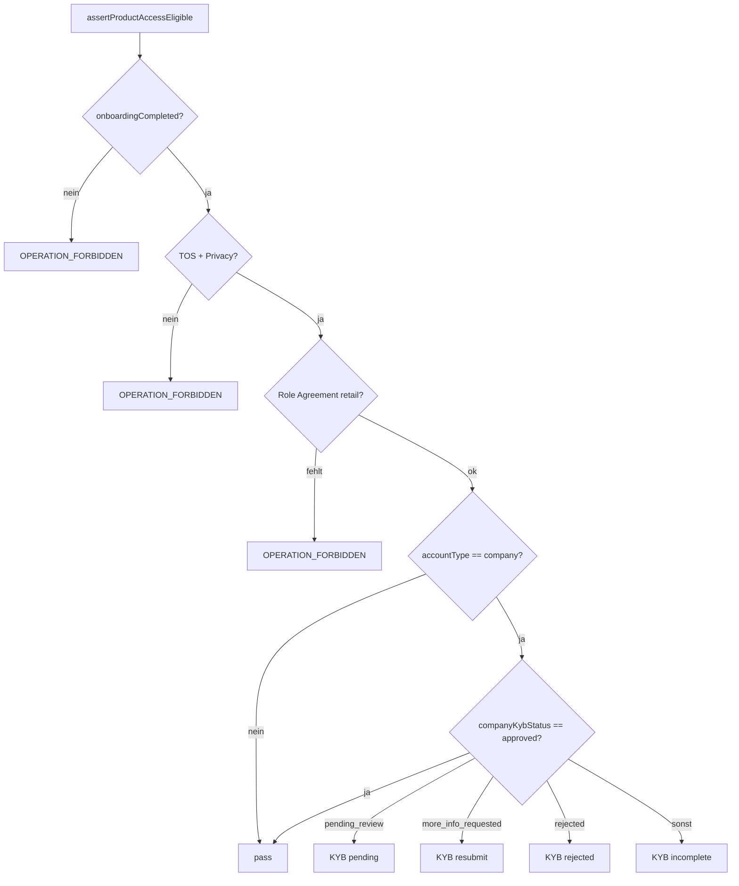

# Epic: Company KYB — Regulated Product Gate (P3-A)

## Ziel

Firmen-Investoren (`accountType == company`, `role == investor`) dürfen **Investing** erst nutzen, wenn KYB **freigegeben** ist (`companyKybStatus == approved`). Server und iOS zeigen konsistente Sperre + Hinweis — analog zu `productAccessGate` für Onboarding/Legal/Role Agreement.

| | |
|---|---|
| **Zeithorizont** | 2–4 Tage (Gate + iOS-Hinweise + Abnahme) · Dokument-Upload separat (P3-B) |
| **Story Points** | ~8 |
| **Bezug** | [`COMPANY_KYB_ONBOARDING.md`](../COMPANY_KYB_ONBOARDING.md) P3, [`ADR-003-Company-KYB-Onboarding.md`](../ADR-003-Company-KYB-Onboarding.md) |

---

## 1. Problem (Ist)

| Ebene | Stand vor Epic |
|-------|----------------|
| **iOS Wizard** | 8 Steps, Einreichung → `pending_review` ✅ |
| **Admin** | `/kyb-review`, `reviewCompanyKyb` ✅ |
| **`productAccessGate`** | Prüft Onboarding + TOS/Privacy + Role Agreement — **kein KYB-Status** ❌ |
| **Investing** | Theoretisch möglich bei `pending_review` / `more_info_requested` |
| **Dokumente Step** | Nur Metadaten + Bestätigungs-Toggle — kein Upload (P3-B) |

---

## 2. Soll — Gate-Regeln (SSOT)



### Backend (`productAccessGate.js`)

| `companyKybStatus` | Verhalten |
|--------------------|-----------|
| `approved` | Gate passiert KYB-Teil |
| `pending_review` | Block: Review läuft |
| `more_info_requested` | Block: Nutzer soll KYB in App fortsetzen |
| `rejected` | Block: Support |
| `draft` / fehlend / `companyKybCompleted == false` | Block: KYB unvollständig |

**Betroffene Cloud Functions** (bestehend, Gate erweitert):

- `investmentCreateSplits`, `createInvestment` (`investment.js`)
- `upsertTrade`, Sell-Execution (`tradingUpsertTrade.js`, `tradingSellOrderExecution.js`)
- Optional Folge-Epic: `placeOrder` in `trading.js`

### iOS (Client-Gate, Phase 1)

Neue SSOT auf `User`:

```swift
var isCompanyKybApproved: Bool
var regulatedProductAccessBlockReason: RegulatedProductAccessBlockReason?
var isEligibleForRegulatedProductAccess: Bool
```

**UI:** `DashboardTradingAccessNotice` oder dedizierte `CompanyKybAccessNotice` auf:

- `NewInvestmentButton`, `InvestorDiscoveryView`, `TraderInvestButton`
- Optional später: Buy/Sell (Trader-Firmen gibt es nicht — Scope nur Investor)

**Hinweistexte (DE, Kurz):**

| Status | Nutzer-Message |
|--------|----------------|
| `pending_review` | „Ihre Firmenunterlagen werden geprüft. Investieren ist nach Freigabe möglich.“ |
| `more_info_requested` | „Bitte ergänzen Sie Ihre KYB-Angaben in der App.“ |
| `rejected` | „KYB abgelehnt — bitte kontaktieren Sie den Support.“ |
| sonst | „Bitte schließen Sie das Firmen-Onboarding (KYB) ab.“ |

---

## 3. User Stories

### US-KYB-G1 Server-Gate

Als Plattform möchte ich Investing blockieren, bis KYB freigegeben ist.

**Akzeptanz:**

- `assertProductAccessEligible` wirft `OPERATION_FORBIDDEN` für `accountType=company` ohne `companyKybStatus=approved`
- Unit-Tests in `productAccessGate.test.js` für alle Status
- `individual`-Konten unverändert

### US-KYB-G2 iOS-Hinweis

Als Firmen-Investor sehe ich, warum „Investieren“ gesperrt ist.

**Akzeptanz:**

- Investment-Entry-Points zeigen Notice statt still disabled
- Tap auf gesperrten Flow öffnet bei `more_info_requested` optional `CompanyKybView` (Resume)

### US-KYB-G3 Abnahme

Als QA/Compliance kann ich den Pfad dokumentiert prüfen.

**Akzeptanz:**

- Checkliste `RELEASE_ABNAHME_KYB_PRODUCT_GATE.md` (siehe §5)
- Admin approve → App refresh → Investieren freigeschaltet

---

## 4. Phasen

| Phase | Inhalt | Aufwand |
|-------|--------|---------|
| **P3-A1** | Backend Gate + Tests | 0,5–1 d |
| **P3-A2** | iOS `User` SSOT + Investment-UI | 1–1,5 d |
| **P3-A3** | Abnahmeprotokoll + Docs (03, 02A, compliance.md) | 0,5 d |
| **P3-B** | Dokument-Upload Step 6 (separates Epic) | 3–5 d |
| **P3-C** | Vier-Augen bei `reviewCompanyKyb` (optional Policy) | 2–3 d |

---

## 5. Abnahme-Checkliste (Kurz)

1. Testuser `accountType=company`, KYB `pending_review` → `createInvestmentSplits` → 403 + klare Message
2. Admin `reviewCompanyKyb` → `approved`
3. Gleicher User → Investment erfolgreich (sofern RC ≥ 5, Role Agreement, Cash)
4. iOS: Notice verschwindet nach Refresh / `userDataDidUpdate`
5. `individual`-Investor Regression: unverändert

**Protokoll-Vorlage:** `Documentation/RELEASE_ABNAHME_KYB_PRODUCT_GATE.md` (anlegen bei Go-Live)

---

## 6. Nicht-Ziele

- KYB-Wizard UI-Redesign
- Trader für Firmen
- Vier-Augen in P3-A (eigenes Ticket P3-C)
- Echter Dokumenten-Upload (P3-B)

---

## 7. Referenzen

- Backend: `backend/parse-server/cloud/utils/productAccessGate.js`
- Admin: `admin-portal/src/pages/KYBReview/`
- iOS: `FIN1/Features/CompanyKyb/`, `UserExtensions.swift`
- Compliance: `.cursor/rules/compliance.md`
