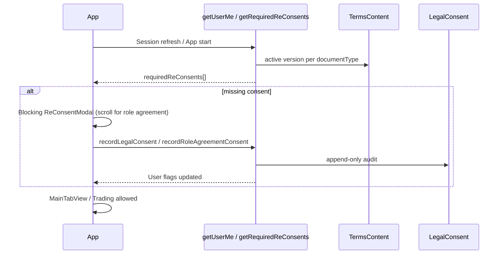

# Epic: Post-Onboarding Re-Consent bei kritischen Vertragsupdates

**Status (2026-06):** ✅ **Done** — Backend PR #11, iOS PR #12, Abnahme-Runbook PR #13; Staging-Abnahme **Go** ([`RELEASE_ABNAHME_RE_CONSENT.md`](../RELEASE_ABNAHME_RE_CONSENT.md)).

## Ziel

Wenn eine **neue aktive Version** von AGB, Datenschutz oder Rollenvereinbarung (`TermsContent`) veröffentlicht wird, müssen **bestehende** Nutzer die Änderung **explizit** bestätigen, bevor sie Trading/Investing weiter nutzen. Audit-trail-fähig, analog zu Gate 1 (Device) und Gate 2 (Onboarding), aber für **laufende** Konten.

| | |
|---|---|
| **Zeithorizont** | 1–1,5 Wochen (1 Dev, fokussiert) |
| **Story Points** | ~21 |
| **Trigger aus Onboarding Epic v2** | Eigenständiges Epic — nicht in State-Machine v2 mischen |

**Rechtliche Basis im Produkt:** Role-Agreement-Klausel zu kritischen Vertragsänderungen; TOS/Privacy-Update-Prozess über Admin „AGB & Rechtstexte“.

---

## 1. Ist vs. Soll

| Dokument | Gate 1 (Contact) | Device-Gate (Login) | Gate 2 (Onboarding) | **Re-Consent (neu)** |
|----------|------------------|---------------------|---------------------|----------------------|
| TOS | ✅ | ✅ Modal | — | ✅ bei neuer Version |
| Privacy | ✅ | ✅ Modal | — | ✅ bei neuer Version |
| Role Agreement | — | — | ✅ Step 24 | ✅ bei neuer Version |
| Imprint | Anzeige | — | — | optional (kein Block) |

**Ist:** Nach Onboarding blockiert nur das **Device-Gate** TOS/Privacy pro Install. **Role Agreement** wird nicht erneut abgefragt, wenn Admin `trader_agreement` / `investor_agreement` aktiviert.

**Soll:** Server vergleicht `_User.*Version` mit aktiver `TermsContent.version`; bei Drift → **blocking flow** bis `recordLegalConsent` / `recordRoleAgreementConsent` mit `source: app`.

---

## 2. Architektur



### 2.1 Backend

**Neue oder erweiterte Cloud Function:** `getRequiredReConsents` (auth required)

Response-Beispiel:

```json
{
  "required": [
    {
      "consentType": "terms_of_service",
      "documentType": "terms",
      "activeVersion": "2.1",
      "userVersion": "2.0",
      "blocking": true
    },
    {
      "consentType": "investor_agreement",
      "documentType": "investor_agreement",
      "activeVersion": "1.1",
      "userVersion": "1.0",
      "blocking": true,
      "requiresScrollToAccept": true
    }
  ]
}
```

Logik (SSOT in `legalConsentUserSync.js` erweitern):

- Aktive Version: `getCurrentActiveLegalVersion(documentType, language)`
- User-Version: Felder auf `_User` (`acceptedTermsVersion`, `acceptedInvestorAgreementVersion`, …)
- Fallback: neueste `LegalConsent` Zeile pro `consentType`
- `blocking: true` nur für TOS, Privacy, passende Role Agreement (retail)

**`productAccessGate` erweitern:**

- Nach bestehenden Checks: aktive Version === User-Version für TOS, Privacy, Role Agreement
- Fehlermeldung: `"Terms of Service must be re-accepted (version X required)."` (spezifisch pro Typ)

**Consent-Aufzeichnung:**

| Typ | Function | `source` |
|-----|----------|----------|
| TOS / Privacy | `recordLegalConsent` | `app` |
| Role Agreement | `recordRoleAgreementConsent` | `app` |

Idempotenz bleibt: `(userId, consentType, version, source, deviceInstallId)`.

**Optional:** E-Mail an Nutzer bei Aktivierung neuer Version (Ops/Admin Hook oder `setActiveTermsContent` Trigger — nur Hinweis, kein Ersatz für In-App-Consent).

### 2.2 iOS

**Neuer Flow:** `ReConsentCoordinator` oder Erweiterung `TermsAcceptanceViewModel`

| Aspekt | Verhalten |
|--------|-----------|
| Trigger | Nach Login, nach `getUserMe`, vor regulierten Aktionen |
| UI | Wiederverwendung `TermsAcceptanceModalView` (TOS+Privacy); **eigenes** `RoleAgreementReConsentView` mit `ScrollToAcceptReader` für Role Agreement |
| Reihenfolge | Alle `required[]` der Reihe nach — Modal schließt erst wenn alle erledigt |
| Device store | TOS/Privacy weiter in `DeviceLegalConsentStore`; Role Agreement nur Konto + `LegalConsent` |
| Gate | `User.isEligibleForRegulatedProductAccess` inkl. Version-Match |

**Kein Konflikt mit Gate 1:** Frische Registrierung spiegelt Gate 1 lokal; Re-Consent betrifft **Version-Drift** auf bestehendem Konto.

### 2.3 Admin / Legal Ops

- Neue Version in Admin „AGB & Rechtstexte“ → „Als aktiv setzen“
- Bestehend: `AuditLog` `legal_document_deactivated` / `legal_document_version_created`
- **Runbook:** Nach Aktivierung → Kommunikation an Nutzer (optional) → Monitoring `getRequiredReConsents` Count / Support-Tickets

---

## 3. User Stories

### US-RC1 Re-Consent TOS/Privacy

Als bestehender Nutzer möchte ich nach AGB-/DSE-Update informiert werden und erneut zustimmen.

**Akzeptanz:**

- Aktive Version > User-Version → blocking Modal
- `recordLegalConsent` + `_User.acceptedTermsVersion` aktualisiert
- `productAccessGate` passiert danach

### US-RC2 Re-Consent Role Agreement

Als Trader/Investor möchte ich nach Änderung der Rollenvereinbarung den Volltext scrollen und erneut bestätigen.

**Akzeptanz:**

- Scroll-to-end + Checkbox (wie Step 24)
- `recordRoleAgreementConsent`, `source: app`
- PDF-Bestätigungsmail optional (`sendConfirmationEmail: true`)

### US-RC3 Server erzwingt Re-Consent

Als Compliance möchte ich, dass API-Umgehung der App nicht möglich ist.

**Akzeptanz:**

- `createInvestmentSplits` / `upsertTrade` blockiert bei Version-Drift
- Tests in `productAccessGate.test.js` + `roleAgreementConsent.test.js`

### US-RC4 Audit

Als Compliance möchte ich pro Re-Consent nachvollziehen: wer, wann, welche Version, welches Gerät.

**Akzeptanz:**

- `LegalConsent` append-only mit IP, UA, `deviceInstallId`, `appVersion`
- Admin kann User-Timeline einsehen (Folge-Epic Compliance-Audit)

---

## 4. Phasen & Aufwand

| Phase | Inhalt | Tage |
|-------|--------|------|
| **1 — Backend SSOT** | Version-Vergleich, `getRequiredReConsents`, `productAccessGate` | 2 |
| **2 — iOS TOS/Privacy** | Modal-Erweiterung, Refresh nach Accept | 1,5 |
| **3 — iOS Role Agreement** | Re-Consent-View + Scroll | 1,5 |
| **4 — Tests & Docs** | Unit/Integration, 03, LEGAL_DOCS, 02_REQUIREMENTS | 1 |
| **5 — Ops Runbook** | Admin-Prozess, Staging-Test mit neuer TermsContent-Version | 0,5 |

**Gesamt:** ~6–7 Dev-Tage

---

## 5. Testplan

### Backend

- User mit `acceptedTermsVersion=1.0`, aktiv `2.0` → gate fails
- Nach `recordLegalConsent` 2.0 → gate passes
- Investor: `investor_agreement` drift analog
- Company + KYB approved: Re-Consent **und** KYB Gate unabhängig

### iOS (manuell)

1. Staging: neue inaktive TermsContent-Version anlegen → aktiv setzen
2. App starten → Modal erscheint
3. Accept → Dashboard + Investment ohne Fehler
4. Zweites Gerät: Device-Gate **und** ggf. Re-Consent falls Version fehlt

### Regression

- Frisch registrierter User: kein doppeltes Modal (Gate 1 Mirror + Re-Consent)
- Onboarding Step 24 unverändert (Gate 2 bleibt Erst-Consent)

---

## 6. Risiken & Mitigation

| Risiko | Mitigation |
|--------|------------|
| Nutzer „gesperrt“ nach Admin-Freigabe | Staging-Test Pflicht; Rollback = alte Version reaktivieren |
| Doppel-Modal Gate 1 + Re-Consent | Version-Vergleich nur wenn User-Version **gesetzt** und **< aktiv** |
| 24 Signup-Steps brechen | Kein Eingriff in SignUpCoordinator — separater Post-Login-Pfad |
| Role Agreement ohne Scroll | Gleicher `ScrollToAcceptReader`-Contract wie Step 24 |

---

## 7. Abgrenzung

| Epic | Inhalt |
|------|--------|
| **FIN1-ONB-v2** | Onboarding State Machine — **ohne** Re-Consent |
| **FIN1-KYB-GATE** | Firmen-KYB vor Investing |
| **FIN1-LEGAL-RECONSENT** | Version-Drift bestehender Consents |

---

## 8. Dokumentations-Updates (bei Umsetzung)

- `LEGAL_DOCS_AUDIT_TRAIL.md` — Abschnitt „Re-Consent (Post-Onboarding)“ ✅
- `03_TECHNISCHE_SPEZIFIKATION.md` — `getRequiredReConsents`, erweitertes `productAccessGate` ✅
- `02_REQUIREMENTS.md` — US-RC1–RC4 ✅
- `02A_FEATURE_KATALOG_GUARDRAILS.md` — Post-Login Re-Consent-Gate ✅
- `.cursor/rules/compliance.md` — Re-Consent Pflicht ✅

---

## 9. Go-Kriterium

Epic **done**, wenn:

- [x] Admin kann neue TOS-Version aktivieren und Staging-User wird blockiert bis Accept
- [x] Role-Agreement-Re-Consent mit Scroll + Audit
- [x] `productAccessGate` + iOS-Gate aligned
- [x] Abnahmeprotokoll `RELEASE_ABNAHME_RE_CONSENT.md` ausgefüllt (Staging Go, 2026-06)
