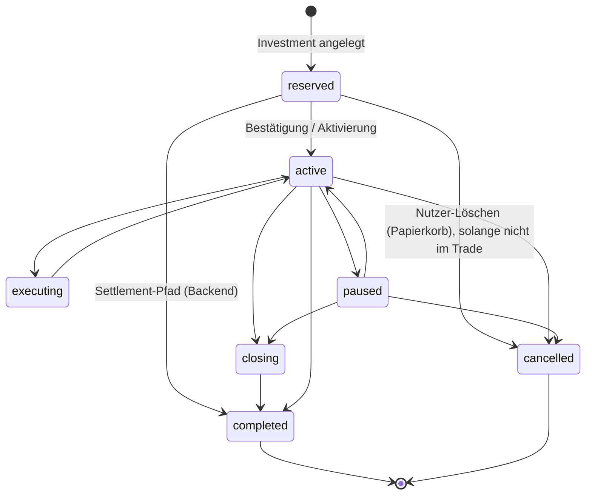

## 1. Zweck

Dieses Dokument beschreibt ein **Zielbild** für die doppelte Buchführung rund um **reservierte Investments** und **Pool-/Mirror-Trades**: interne Konto-/Saldo-Sicht (verfügbar vs. gebunden) und **App-Hauptbuch**-Gegenkonten. Es ist **keine** Endnutzer-Doku.

**Maßgeblich bei Widerspruch:** Code unter `backend/parse-server/cloud/**` und `FIN1/**` – die Skizze ist eine Referenz für die **weitere Implementierung**.

### Hinweis zur Einordnung (keine Rechts- oder BaFin-Beratung)

Binding **Zulassungen**, **Pflichten** und **Jahresabschluss** im Sinne von HGB/GoB und Aufsicht (BaFin u. a.) entscheiden **Steuerberatung / Wirtschaftsprüfung / Legal** im Einzelfall. Unten steht eine **technische und buchlogische Empfehlung**, wie FIN1 intern konsistent und auditierbar arbeiten sollte — vergleichbar mit üblicher Praxis bei Plattformen mit Kundenguthaben und Gebühren.

### Empfohlene Leitlinie für FIN1 (Best Practice, umsetzbar im Produkt)

1. **Eine belastbare Quelle der Wahrheit** – Alle saldenwirksamen Vorgänge (Reservierung, Gebühr, Aktivierung, Trade-Rückfluss) werden **serverseitig** ausgelöst und protokolliert; die App zeigt denselben Stand (kein dauerhaft abweichendes „Schattenbuch“ nur auf dem Gerät).
2. **Kundengeld logisch trennen** – Alles, was dem Nutzer **noch wirtschaftlich zusteht**, läuft über **Verbindlichkeits-Teilkonten** (`CLT-LIAB-*`: verfügbar → reserviert → im Handel). Das ist **kein** Ersatz für bankrechtliche **Sondervermögen** oder Treuhand; es ist die **interne** Spiegelung für Nachvollziehbarkeit und spätere ERP-Anbindung.
3. **Plattform-Erlöse eigenständig und ausgeglichen** – Gebühren: nach **Leistungsauslösung** (bei euch: mit Abschluss des Anlageauftrags + **Beleg/Rechnung**) **vollständiger Buchungssatz** (z. B. Verrechnung Soll, Erlös + USt Haben) im App-Ledger; **keine** „Haben ohne Soll“.
4. **Unwiderrufliche Gebühr vs. widerrufliche Reservierung** – Wenn die Gebühr **vertraglich** mit Auftragserteilung fällig wird, ist die **Buchung endgültig**; eine Rückerstattung ist dann nur noch über **ausdrücklichen Kulanz- / Storno-Prozess** mit **Gutschrift** (nicht still durch Löschen eines Splits). **Kapital-Reservierung** eines Splits darf dagegen **storniert** werden, solange **noch keine** bindende Einbindung in den Handel besteht — das entspricht einer reinen **Umschichtung innerhalb der Kundenverbindlichkeit**.
5. **GoB „ordnungsmäßig“ im engeren Sinne** – Vollständige **Handelsbücher**, **Inventar**, **Anlagen** und **Abschluss** führt typischerweise ein **externes Finanzsystem** oder Steuerberater aus Parse/Exporten; FIN1 sollte aber **Lückenlose Belegreferenzen**, **unveränderbare Zeitfolge** und **Klärung Debit/Haben** auf Plattformebene liefern.

Die folgenden **Produktregeln** setzen Punkt 4 in eurer konkreten UX um.

### Produktregeln (Klarstellung, um Verwechslungen zu vermeiden)

1. **App Service Charge** – Sobald der Investor den Investment-Flow **abgeschlossen** hat (Betrag + Strategie/Split bestätigt; vgl. Investment-Sheet), wird die **anfallende Gebühr sofort und unwiderruflich** vom verfügbaren Kundenguthaben abgebucht. Ein späteres Löschen einzelner **Teil-Investments** ändert daran **nichts** (keine Rückerstattung der Gebühr).
2. **Gesplittete Teil-Investments** – Jeder Split (`Investment` mit `reservationStatus`/„reserved“) kann der Investor über den **Löschen-Button (Papierkorb)** so lange **zurücknehmen**, wie das Teil-Investment **noch nicht** in einen **laufenden Trade / aktive Ausführung** eingebunden ist (im Code u. a. nur Löschen bei `reservationStatus == .reserved`; sobald z. B. **active** im Sinne des Handels, entfällt die Widerrufsmöglichkeit über diesen Weg).

Diese Regeln gelten **fachlich** unabhängig davon, ob Abbuchung und Storno **nur clientseitig** oder bereits **vollständig serverseitig** gespiegelt sind (siehe §6).

---

## 2. Kontenrahmen (minimal, 5 Konten)

Alle `CLT-*`-Konten sind **wirtschaftlich Verbindlichkeiten gegenüber Kund:innen** (Teilbeträge derselben Gesamtverbindlichkeit). Sie dienen der **nachvollziehbaren Umschichtung**; die Summe über alle Teilkonten pro Nutzer bzw. global muss sich mit **Konto-/Backend-Regeln** abstimmen.

| Code          | Gruppe (Portal) | Kurzbezeichnung | Rolle |
|---------------|-----------------|-----------------|--------|
| **CLT-LIAB-AVA** | liability | Kundenguthaben – **verfügbar** | Entspricht dem, was die App als „sofort verfügbar“ führt (Auszahlbarkeit nach Produktregeln). |
| **CLT-LIAB-RSV** | liability | Kundenguthaben – **reserviert** | Nach Zusage/Anlage gebunden, noch nicht im Handel eingesetzt. |
| **CLT-LIAB-PTR** | liability | Kundenguthaben – **PoolTrade** (Stückkauf) | Kapital, das der Pool-/Mirror-Logik zugeführt ist (noch Kundenverbindlichkeit bis Auszahlung/Rückfluss). Früher `CLT-LIAB-TRD`. |
| **CLT-LIAB-PPS** | liability | Kundenguthaben – **Teilverkauf Pool-Trade** (ausstehend) | ADR-015: bei Partial Sell PTR→PPS; bei Trade-Ende PPS→AVA. SKR03 1593. |
| **CLT-EQT-INV-PNL** | equity | Investor-Erfolg (Trade-/Teilverkauf, intern) | Partial Sell: INV-PNL→PPS (Brutto-Gewinn); Settlement: INV-PNL→AVA. SKR03 8900. |
| **PLT-CLR-GEN**  | clearing  | Verrechnung allgemein | Bereits im System: z. B. **Brutto**-Servicegebühr vor Aufteilung auf Erlös + USt (siehe `triggers/invoice/`). |
| *(bestehend)* **PLT-REV-PSC** / **PLT-TAX-VAT** | revenue / tax | Erlös / USt | Servicegebühr netto / USt; Gegenbuch zu `PLT-CLR-GEN` nach Rechnungsauslösung. |

**Hinweis Crypto (später):** Dieselbe **CLT-LIAB-***-Schicht kann zusätzlich **zur On-Chain-Omnibus-Ebene** spiegeln (Ledger ↔ Blockchain-Abstimmung). Die **Konto-UI** bleibt ein **buchhalterischer Aggregat**, nicht zwingend ein On-Chain-Konto pro User.

---

## 3. Investment-Status und Buchungsimpulse (Zielbild)

Parse-Klasse **`Investment`** – Status laut `backend/parse-server/cloud/triggers/investment.js` u. a.: `reserved` → `active` → (`executing` / `paused` / `closing`) → `completed` oder `cancelled` (mit Einschränkungen bei `reserved` → `completed` für Settlement-Pfade).

---

## 4. Journal-Sätze (schematisch, pro Investment-Betrag)

Betragsseite: **`amount`** = Nominal des **einzelnen** `Investment` (wie `Investment.amount`), Servicegebühr **separat** (eigenes Ereignis / Rechnung, nicht in dieser Tabelle).

| Ereignis | Auslöser (Ziel) | Soll | Haben | Bemerkung |
|----------|-----------------|------|-------|-----------|
| **Reservieren** | `Investment` neu, Status `reserved` | CLT-LIAB-AVA | CLT-LIAB-RSV | **Umschichtung**; Gesamt-Kundenverbindlichkeit unverändert. Parallel: optional `WalletTransaction` / `AccountStatement` nur wenn **eine** Quelle die „verfügbare“ Konto-Sicht definiert (siehe §6). |
| **Aktivieren / Pool-Zuführung** | `reserved` → `active` | CLT-LIAB-RSV | CLT-LIAB-PTR | Kapital „im Strategieraum“. Parallel aktuell Server: `WalletTransaction` `investment` (Abbuchung verfügbarer Kontosaldo) + `AccountStatement` `investment_activate` – **Ist** muss mit dieser Umschichtung konsolidiert werden, um keine doppelte Wirkung zu erzeugen. |
| **Partial Sell (Investor)** | Trader-`sellOrder` (Trade offen) | CLT-LIAB-PTR → CLT-LIAB-PPS (Einstand); CLT-EQT-INV-PNL → CLT-LIAB-PPS (Brutto-Gewinn) | — | Interner Eigenbeleg; **kein** `investment_return` (ADR-015). |
| **Trade-Abwicklung / Settlement** | `settleAndDistribute` u. a. | CLT-LIAB-PTR / CLT-LIAB-PPS / CLT-EQT-INV-PNL | CLT-LIAB-AVA | Rest PTR + kumuliertes PPS + Gewinn → verfügbar; parallel `investment_return` auf Kontoauszug. |
| **Storno nur reserviert** | Nutzer löscht Teil-Investment (Papierkorb), noch kein Trade | CLT-LIAB-RSV | CLT-LIAB-AVA | Rückgängig nur **Kapital-Reservierung** des Splits; **Servicegebühr** bleibt gebucht (nicht erstattungsfähig). |
| **Storno nach aktiv** | `active` → `cancelled` (+ Refund) | CLT-LIAB-PTR (bzw. Teilbeträge) | CLT-LIAB-AVA | An bestehende Refund-/Konto-Logik anbinden. |

Servicegebühr (Batch): unverändert über **Invoice** → `PLT-CLR-GEN` (Soll brutto) / `PLT-REV-PSC` + `PLT-TAX-VAT` (Haben), Bank-Contra optional parallel.

---

## 5. Bindung an bestehende Bausteine

| Baustein | Rolle |
|----------|--------|
| `Investment` (Parse) | Lebenszyklus **reserved / active / …**; Trigger `cloud/triggers/investment.js`. |
| `WalletTransaction` | Laufende **verfügbare** Salden; `transactionType` `investment` u. a.; `cloud/triggers/wallet.js`. |
| `AccountStatement` | Investor-nahe **Cash-Sicht** / Nachweis; `bookAccountStatementEntry` in `utils/accountingHelper/statements.js`. |
| `AppLedgerEntry` | Plattform-Hauptbuch (Eigenkonten); Erweiterung um **CLT-LIAB-***-Buchungen bei Implementierung. |
| `PoolTradeParticipation` / Trade-Settlement | Übergang **TRD** ↔ Rückfluss; `utils/accountingHelper/settlement.js`. |

### 5.1 Code-Modulstruktur (`investmentEscrow`)

Implementierung: **`cloud/utils/accountingHelper/investmentEscrow.js`** (dünne **Fassade**, unveränderte `require('./investmentEscrow')`-API) und Unterordner **`investmentEscrow/`** (analog zu `statements.js` → `accountStatementWriter.js` usw.).

| Modul | Verantwortung | Wichtige Legs / Funktionen |
|-------|---------------|----------------------------|
| `constants.js` | SSOT `transactionType`, Konten, Settlement-Leg-Liste | `investmentEscrow`, `TRADE_SETTLEMENT_ESCROW_LEGS` |
| `ledgerQueries.js` | Parse-Queries, Idempotenz, Summen | `hasEscrowLeg`, `sumEscrowLeg*`, `hasTradeSettlementEscrow` |
| `ledgerBuilders.js` | Doppelbuchungs-Paare / Einzelzeilen | `baseFields`, `buildPairedLedgerEntries`, `savePair` |
| `escrowReserve.js` | Schritt 1 Reservierung (GoB: Beleg vor Buchung) | `bookReserve` → `leg: reserve` |
| `escrowDeploy.js` | RSV → PTR (+ Reversal vor Split) | `deploy`, `deployReversalForCapitalSplit` |
| `escrowRelease.js` | Auflösung Reservierung / Handel | `releaseReserve`, `releaseTrading*`, `releaseReservedComplete` |
| `escrowRepair.js` | Admin-Repair / Purge fehlerhafter Legs | `purge*Leg` |
| `escrowCapitalSplit.js` | GoB-Split bei Aktivierung (RSV → PTR + AVA) | `reserveCapitalTradeSplit` |
| `escrowActivation.js` | Orchestrierung Aktivierung + Kontoauszug | `ensureReserveCapitalTradeSplitOnActivation`, `resolveActivationCapitalSplitAmounts` |
| `escrowSettlement.js` | Collection-Bill-Payout | `tradeSettlementPoolRelease`, `tradeSettlementProfitRelease`, … |
| `escrowPartialSell.js` | ADR-015 Teilverkauf (intern) | `partialSellRelease`, `partialSellProfitRecognition` |

**Öffentliche API (Fassade `investmentEscrow.js` → `investmentEscrow/publicSurface.js`):**

| Tier | Exports | Neuer Code |
|------|---------|------------|
| **1 — Stable booking** | `bookReserve`, `bookReleaseReservation`, `bookReleaseTrading`, `bookReleaseReservedOnComplete`, `ensureReserveCapitalTradeSplitOnActivation`, `bookReserveCapitalTradeSplit`, `bookTradeSettlementPayout`, `bookPartialSellPoolRelease`, `bookPartialSellProfitRecognition` | Ja |
| **2 — Settlement support** | `hasEscrowLeg`, `hasTradeSettlementEscrow`, `resolveActivationCapitalSplitAmounts` | Ja (Settlement/Repair) |
| **3 — Repair purge** | `purgeReleaseTradingResidualCorrectionLeg`, `purgeTradingResidualReturnLeg`, `purgeReserveCapitalTradeSplitLeg`, `purgeDeployReversalForCapitalSplitLeg` | Nur Admin-Repair/Backfill |
| **4 — Package-internal** | `bookDeployToTrading`, `bookDeployForPoolParticipation`, `bookTradingResidualReturn`, `ledgerQueries` sum-*, `buildPairedLedgerEntries`, `TRANSACTION_TYPE` | **Nein** — nur Submodule/`investmentEscrow/` |

Contract-Test: `__tests__/investmentEscrow.publicSurface.test.js`. Submodule-Tests: `investmentEscrow.ledgerBuilders.test.js`, …

**Aufrufer (Auswahl):** `triggers/investmentTriggerAfterSave*.js`, `settlementParticipationPosting.js`, `settlementInvestorPartialRealization.js`, `financialSettlementRepair.js`, `poolMirrorActivationService.js`.

Tests: `cloud/utils/accountingHelper/__tests__/investmentEscrow.test.js` (Characterization / Golden-Legs).

---

## 6. Ist-Zustand vs. Ziel (kurz)

- **Servicegebühr:** Unwiderruflich bei Flow-Abschluss; App-Ledger über Invoice (`PLT-CLR-GEN` etc.) – `triggers/invoice/`.
- **Escrow (AppLedger):** Fassade `investmentEscrow.js` + Module unter `investmentEscrow/` (siehe §5.1); Trigger `triggers/investment.js` u. a.: **reserve** bei neuem Investment, **deploy** bei `reserved→active`, **releaseReserve** + Konto/Statement bei `reserved→cancelled`, **releaseTrading** bei Abschluss/Storno nach Aktiv, **releaseReservedComplete** bei `reserved→completed`.
- **Papierkorb:** Cloud Function `cancelReservedInvestment` (Investor); iOS ruft sie bei Parse-`objectId` auf, sonst lokaler Fallback mit Konto-Gutschrift (`InvestmentService.deleteInvestment`).
- **Kontocodes:** `CLT-LIAB-AVA` / `RSV` / `TRD` im Admin-Kontenrahmen und `AppLedgerAccount` (Swift).

---

## 7. Siehe auch

- [`FIN1_APP_DOCS/11_APP_LEDGER_BUCHHALTER_MANUAL.md`](FIN1_APP_DOCS/11_APP_LEDGER_BUCHHALTER_MANUAL.md) – Kontext Eigenkonten / Gebühren.
- [`FIN1_APP_DOCS/03_TECHNISCHE_SPEZIFIKATION.md`](FIN1_APP_DOCS/03_TECHNISCHE_SPEZIFIKATION.md) – Gesamtarchitektur (Parse, Datenmodell).
