# Paired Buy → Sell → Investor Bill — Invarianten (SSOT)

**Maßgeblich** für Ops-Checks, Incident-Triage und Release-Abnahme bei `executePairedBuy` mit Pool-Mirror.

Verwandte Dokumente: [BOOKING_AND_BELEG_SSOT.md](./BOOKING_AND_BELEG_SSOT.md), [BACKEND_CALCULATION_MIGRATION.md](./BACKEND_CALCULATION_MIGRATION.md)

---

## Architektur-Kurzfassung

| Leg | `Order` (UI/Admin-Liste) | `Trade` (Buchhaltung) | Pool |
|-----|--------------------------|------------------------|------|
| **TRADER** | Buy + Sell Orders | Trader-Depot-Trade | — |
| **MIRROR_POOL** | **nur Buy Order** | separater Mirror-Trade | `PoolTradeParticipation` |

**Wichtig:** Der Investor-„Verkauf“ existiert **nicht** als `Order side:sell` am MIRROR_POOL-Leg. Er existiert als:

1. `Trade.sellOrders` / Exit-Felder am **Mirror-Trade** (gespiegelt aus TRADER-Leg via `pairedTradeMirrorSync.js`)
2. `settleAndDistribute` → `investorCollectionBill` + `AccountStatement` pro Participation

Ein fehlender Mirror-Sell-**Order** ist **kein** Defekt. Ein fehlender Mirror-Sell auf **Trade** oder fehlgeschlagenes **Settlement** schon.

---

## Zustandsautomat (vereinfacht)

```mermaid
stateDiagram-v2
  direction LR
  [*] --> PairedCommitted: executePairedBuy
  PairedCommitted --> BuySettled: commitPairedBuyExecution
  BuySettled --> PoolActive: allocateTradeToInvestmentPools (mirror)
  PoolActive --> TraderSelling: trader sell Order executed
  TraderSelling --> MirrorSynced: syncMirrorPoolSellProgress / syncMirrorTradeWhenTraderLegCompletes
  MirrorSynced --> InvestorSettled: settleAndDistribute (SettlementRetryJob)
  InvestorSettled --> [*]: participations.isSettled + CollectionBills
```

---

## Invarianten-Matrix

### Phase A — Buy / Pool-Aktivierung

| ID | Invariante | Prüfkriterium (Server) | Severity |
|----|------------|------------------------|----------|
| **A1** | Paired legs committed | `PairedExecution.effectsApplied === true` | blocking |
| **A2** | Beide Buy-Legs haben Trade | `Order.tradeId` für TRADER + MIRROR_POOL | blocking |
| **A3** | Mirror-Trade `buyLegType === MIRROR_POOL` | `Trade.buyLegType` | blocking |
| **A4** | Pool aktiviert | `PoolTradeParticipation` count ≥ 1 auf **Mirror-Trade** | blocking |
| **A5** | Participations nur am Mirror | keine Participations auf TRADER-Trade | blocking |

**Implementierung:** `verifyPairedBuySettlement` (`pairedBuyOrchestration.js`), `getPairedBuyPoolIntegrityStatus`

---

### Phase B — Trader-Verkauf / Mirror-Sync

| ID | Invariante | Prüfkriterium | Severity |
|----|------------|---------------|----------|
| **B1** | Trader hat Sell-Aktivität | `soldQuantity > 0` oder `sellOrders.length > 0` | info (wenn offen: skip B2–D) |
| **B2** | Mirror-Trade hat Exit-Ökonomie | `sellOrders` / `sellAmount` / `grossProfit` ≠ 0 | **blocking** wenn B1 |
| **B3** | Kein Trader-Cash auf Mirror-Leg | keine `trade_buy`/`trade_sell` auf MIRROR Trade Personenkonto | blocking |

**Implementierung:** `pairedTradeMirrorSync.js`, `getTraderMirrorBookingIntegrityStatus`

**Nicht** prüfen: `Order side:sell` am MIRROR_POOL-Leg (by design absent).

---

### Phase C — Settlement / Investor-Abrechnung

| ID | Invariante | Prüfkriterium | Severity |
|----|------------|---------------|----------|
| **C1** | Settlement-Job nicht blockiert | kein `SettlementRetryJob` `pending`/`failed` mit `lastError` für TRADER-`tradeId` | **down** |
| **C2** | Participations abgerechnet | alle `PoolTradeParticipation.isSettled === true` auf Mirror-Trade | blocking |
| **C3** | Collection Bills vollständig | `Document` type `investorCollectionBill` count ≥ participation count (Mirror-`tradeId`) | blocking |
| **C4** | ROI / Mirror-Basis konsistent | `metadata.returnPercentage` vs SSOT (separater Drift-Check) | degraded |

**Implementierung:** `settleAndDistribute` (`settlementCore.js`), `getTradeSettlementConsistencyStatus`, `getMirrorBasisDriftStatus`

### SSOT: `investment_return` vs. Collection Bill

`AccountStatement.entryType === investment_return` bucht den **Überweisungsbetrag** an den Investor — nicht Brutto-Verkaufserlös und **nicht** nochmals die Provision.

| Feld | Bedeutung | Wo |
|------|-----------|-----|
| **`metadata.transferAmount`** | SSOT für `investment_return` | `investorCollectionBill` |
| **`commission_debit`** | separate Zeile, eigener `entryType` | `settlementParticipationPosting.js` |
| **`amount + profit` (Investment)** | Anzeige/Aggregat nach Abschluss; kann vom Pool-Kaufpreis abweichen | `Investment` |

**Ops-Check `getTradeSettlementConsistencyStatus`:** Expected `grossReturn` = `transferAmount` aus Collection Bill (Fallback: `buyLeg.amount + netProfit`). **Nicht** `amount + profit + commission` — das wäre Doppelzählen der Provision.

Siehe auch [BOOKING_AND_BELEG_SSOT.md](./BOOKING_AND_BELEG_SSOT.md) (`transferAmount = netSellAmount − commission`).

---

## Ein Ops-Check (Rollup)

**Cloud Function:** `getPairedSellInvestorChainStatus`  
**Parameter:** `{ limit: 25 }` — letzte N TRADER-Paired-Trades mit Mirror-Pool-Menge > 0

**Rollup in:** `getFinanceIntegrityStatus` → Check-ID `paired_sell_investor_chain`  
**Smoke:** `runFinanceConsistencySmoke` (über Finance-Integrity-Rollup)

### Issue-Codes

| Code | Bedeutung | Typische Repair |
|------|-----------|-----------------|
| `mirror_trade_missing` | Mirror-Trade nicht verknüpft | `finalizePairedBuyAfterCommit` / Order-Handler |
| `mirror_pool_not_activated` | keine Participations | `ensureMirrorPoolActivationForPair` |
| `mirror_trade_missing_sell_economics` | Mirror ohne `sellOrders` trotz Trader-Sell | `syncMirrorTradeWhenTraderLegCompletes` |
| `settlement_retry_blocked` | `SettlementRetryJob.lastError` gesetzt (nur wenn Trade existiert) | Codefix + `reconcileStaleSettlementRetryJobs` + `runSettlementRetryQueue` |
| `participations_not_settled` | `isSettled: false` | Settlement nachziehen |
| `investor_collection_bills_incomplete` | weniger CBs als Participations | `settleAndDistribute` / Backfill |
| `trader_leg_has_pool_participations` | Participations am falschen Trade | Daten-Reparatur (selten) |

---

## Abnahme-Checkliste (manuell / nach Release)

1. Paired Buy mit Pool → Admin: `getPairedSellInvestorChainStatus` → `overall: healthy`
2. Trader Sell (voll) → Mirror-Trade: `sellOrders.length >= 1`
3. Investor-Inbox: N Collection Bills (N = Participations)
4. `getFinanceIntegrityStatus` → keine Issues `paired_sell_investor_chain_*`
5. `SettlementRetryJob` für TRADER-`tradeId`: `status: done` oder kein Eintrag

---

## Prävention (Best Practice)

| Schicht | Maßnahme |
|---------|----------|
| **Prevention** | Ein Buchungspfad pro Concern; Idempotenz-Keys; kein Client-Doppel-Settlement |
| **Detection** | Dieser Check + `SettlementRetryJob.lastError` als `down`, nicht ignoriert |
| **Repair** | `getFinanceRepairCatalog` (Dry-Run-Parameter pro Issue), dann `reconcileStaleSettlementRetryJobs`, `runSettlementRetryQueue`, Eigenbeleg-Backfills |
| **Prevention (P0)** | `getFinanceIntegrityPreventionStatus` / Rollup-Check `finance_prevention_indexes` — Unique-Indexes auf `AccountStatement` |

**Regression-Tests (Pflicht bei Settlement-Änderungen):**

- `settlementTraderLifecycleBooks.test.js` (trading_fees / Import-Pfad)
- `settlementRetryRepair.test.js` (Orphan-/Recoverable-Erkennung)
- `pairedSellInvestorChainIntegrity.test.js` (Exit-Erkennung)
- E2E: `node scripts/e2e-paired-sell-integrity-smoke.js` (seed + assert) oder CI `paired-sell-integrity-smoke.yml`
- E2E assert-only: `E2E_SKIP_SEED=1 node scripts/e2e-paired-sell-integrity-smoke.js`
- **Monitoring (iobox SSOT):** `scripts/run-finance-integrity-monitor.sh` (Cron via `install-finance-integrity-server-cron.sh`); GitHub `finance-integrity-monitor.yml` nur `workflow_dispatch` (kein LAN-Zugriff von Cloud-Runnern)

---

## Code-Referenzen

| Modul | Pfad |
|-------|------|
| Chain-Scanner | `backend/parse-server/cloud/utils/pairedSellInvestorChainIntegrity.js` |
| Ops-Handler | `backend/parse-server/cloud/functions/admin/opsHealthPairedSellInvestorChain.js` |
| Mirror-Sync | `backend/parse-server/cloud/utils/pairedTradeMirrorSync.js` |
| Settlement | `backend/parse-server/cloud/utils/accountingHelper/settlementCore.js` |
| `investment_return`-Posting | `backend/parse-server/cloud/utils/accountingHelper/settlementParticipationPosting.js` |
| Settlement-Consistency-Ops | `backend/parse-server/cloud/functions/admin/opsHealthTradeSettlementConsistency.js` |
| Retry-Queue | `backend/parse-server/cloud/utils/accountingHelper/retryQueue.js` |
| Prevention (Indexes) | `backend/parse-server/cloud/functions/admin/opsHealthFinancePrevention.js` |
| Repair-Katalog | `backend/parse-server/cloud/functions/admin/financeRepairCatalog.js` → `getFinanceRepairCatalog` |
